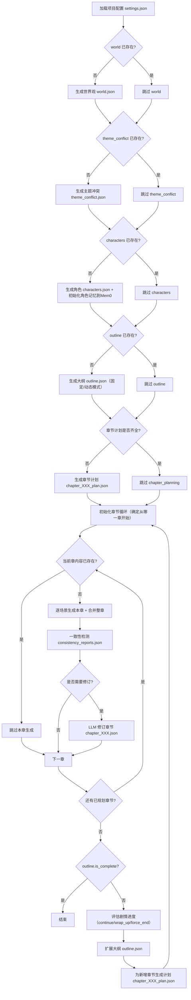
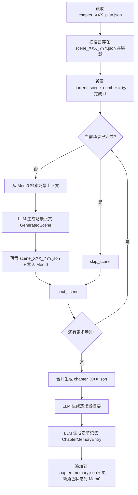

<!--
开发者: jamesenh
创建时间: 2025-12-15
用途: 说明当前 NovelGen 的完整小说生成流程（LangGraph 工作流 + LangChain 链 + Mem0 记忆层）
-->

## 目标与范围

本文档用于说明 **当前代码实现** 下 NovelGen 的“完整生成流程”：

- **步骤级说明**：每一步需要哪些信息、信息来源是什么、输出到哪里（文件/状态/Mem0）。
- **链(Chain)级说明**：每条链的输入/输出（Pydantic 模型）、输入来源、落盘位置、是否使用 LLM。
- **流程图**：用 Mermaid 展示完整流程（概览 + 章节循环 + 场景子循环），不过多展开入参细节。

本文档以以下代码为准：

- 工作流定义：`novelgen/runtime/workflow.py`
- 节点实现：`novelgen/runtime/nodes.py`
- 编排器/状态装载：`novelgen/runtime/orchestrator.py`
- 模型定义：`novelgen/models.py`
- 链实现：`novelgen/chains/*.py`
- 记忆与一致性工具：`novelgen/runtime/memory.py`、`novelgen/runtime/consistency.py`、`novelgen/runtime/summary.py`
- 项目路径约定：`novelgen/config.py`（`ProjectConfig`）

---

## 核心产物与落盘文件（projects/<project_name>/）

项目目录默认：`projects/<project_name>/`

- **输入配置**
  - `settings.json`：用户输入与全局设置（世界观描述、主题方向、initial/max 章节数等）
- **阶段产物（结构化 JSON）**
  - `world.json`：世界观（`WorldSetting`）
  - `theme_conflict.json`：主题冲突（`ThemeConflict`）
  - `characters.json`：角色配置（`CharactersConfig`）
  - `outline.json`：大纲（`Outline`，支持动态扩展字段 `is_complete/current_phase`）
- **章节与场景**
  - `chapters/chapter_XXX_plan.json`：章节计划（`ChapterPlan`）
  - `chapters/scene_XXX_YYY.json`：单场景（`GeneratedScene`，逐场景断点续跑）
  - `chapters/chapter_XXX.json`：整章合并输出（`GeneratedChapter`）
- **一致性/记忆**
  - `consistency_reports.json`：一致性报告集合（`ConsistencyReport[]`）
  - `chapter_memory.json`：章节记忆条目集合（`ChapterMemoryEntry[]`）
- **工作流检查点**
  - `workflow_checkpoints.db`：LangGraph SQLite checkpointer（用于断点续跑/恢复）
- **Mem0（向量/记忆存储）**
  - Mem0 内部使用 ChromaDB，默认目录：`projects/<project_name>/data/vectors/`（可用环境变量覆盖，见 `ProjectConfig.get_vector_store_dir()`）

---

## 完整流程图（概览）

> 说明：工作流会基于“数据是否已存在（state/world/outline 等）”自动跳过已完成步骤（例如 `world.json` 已存在则跳过世界观生成）。

---

## 章节生成（场景子循环）流程图

> 说明：章节生成节点使用“逐场景落盘”支持断点续跑：每个场景完成后立即写 `scene_XXX_YYY.json`，并将内容写入 Mem0；全部场景完成后合并为 `chapter_XXX.json`，同时生成章节记忆 `chapter_memory.json` 并更新角色状态到 Mem0。

---

## 步骤（节点）说明：所需信息 / 来源 / 输出 / 是否LLM

> 这里的“步骤”指 LangGraph 工作流节点（`novelgen/runtime/workflow.py` 引用 `novelgen/runtime/nodes.py` 的函数）。

### 1) load_settings（`load_settings_node`）

- **是否使用 LLM**：否
- **输入（来源）**
  - `projects/<project>/settings.json`（用户提供）
- **输出**
  - 写入状态：`state.settings`（`Settings`）
  - 更新状态字段：`state.completed_steps`、`state.node_execution_count`
- **落盘**：不写新文件（只读取 `settings.json`）

### 2) world_creation（`world_creation_node`）

- **是否使用 LLM**：是（`chains/world_chain.py::generate_world`）
- **输入（来源）**
  - `state.settings.world_description`（来自 `settings.json`）
- **输出**
  - `WorldSetting` → `state.world`
  - 落盘：`projects/<project>/world.json`

### 3) theme_conflict_creation（`theme_conflict_creation_node`）

- **是否使用 LLM**：是（`chains/theme_conflict_chain.py::generate_theme_conflict`）
- **输入（来源）**
  - `state.world`（来自 `world.json` 或上一步生成）
  - `state.settings.theme_description`（来自 `settings.json`，可为空）
- **输出**
  - `ThemeConflict` → `state.theme_conflict`
  - 落盘：`projects/<project>/theme_conflict.json`

### 4) character_creation（`character_creation_node`）

- **是否使用 LLM**：是（`chains/characters_chain.py::generate_characters`）
- **输入（来源）**
  - `state.world`（`world.json`）
  - `state.theme_conflict`（`theme_conflict.json`）
- **输出**
  - `CharactersConfig` → `state.characters`
  - 落盘：`projects/<project>/characters.json`
  - **副作用**：初始化角色状态到 Mem0（写入 entity_state）

### 5) outline_creation（`outline_creation_node`）

- **是否使用 LLM**：是
  - 固定模式：`chains/outline_chain.py::generate_outline`
  - 动态模式：`chains/outline_chain.py::generate_initial_outline`
- **输入（来源）**
  - `state.world`、`state.theme_conflict`、`state.characters`
  - `state.settings.initial_chapters/max_chapters`（来自 `settings.json`）
- **输出**
  - `Outline` → `state.outline`
  - 落盘：`projects/<project>/outline.json`

### 6) chapter_planning（`chapter_planning_node`）

- **是否使用 LLM**：是（`chains/chapters_plan_chain.py::generate_chapter_plan`）
- **输入（来源）**
  - `state.outline.chapters`（来自 `outline.json`）
  - `state.world`（`world.json`）
  - `state.characters`（`characters.json`）
- **输出**
  - `Dict[int, ChapterPlan]` → `state.chapters_plan`
  - 落盘：对每章写 `projects/<project>/chapters/chapter_XXX_plan.json`
- **备注**
  - 当前实现传入 `chapter_memory=""`、`chapter_dependencies=""`（预留扩展点）
  - 若计划文件已存在则直接加载，避免重复生成

### 7) init_chapter_loop（`init_chapter_loop_node`）

- **是否使用 LLM**：否
- **输入（来源）**
  - `state.chapters_plan`、已存在的章节/场景文件状态（用于断点续跑）
- **输出**
  - `state.current_chapter_number`（决定从哪一章开始/继续）

### 8) chapter_generation（`scene_generation_wrapper_node`）

- **是否使用 LLM**：部分使用（场景生成 + 摘要 + 章节记忆均为 LLM）
- **输入（来源）**
  - `state.current_chapter_number`
  - `state.chapters_plan[current]`（`chapter_XXX_plan.json`）
  - `state.world`、`state.characters`
  - Mem0：角色状态与相关记忆检索（向量搜索）
- **输出（主要落盘）**
  - 每个场景：`chapters/scene_XXX_YYY.json`（`GeneratedScene`）
  - 章节合并：`chapters/chapter_XXX.json`（`GeneratedChapter`）
  - 章节记忆：追加写入 `chapter_memory.json`（`ChapterMemoryEntry[]`）
  - Mem0：写入 scene_content 分块；更新角色 entity_state
- **子步骤拆解（对照子图节点）**
  - `retrieve_scene_memory_node`：从 Mem0 检索 `SceneMemoryContext`（非 LLM）
  - `generate_scene_node`：调用 `scene_text_chain` 生成 `GeneratedScene`（LLM）
  - `save_scene_node`：场景落盘 + 写入 Mem0（非 LLM）
  - 合并整章：写 `chapter_XXX.json`（非 LLM）
  - `summarize_scenes`：逐场景摘要（LLM）
  - `generate_chapter_memory_entry`：生成结构化章节记忆（LLM）

### 9) consistency_check（`consistency_check_node`）

- **是否使用 LLM**：是（`runtime/consistency.py::run_consistency_check`）
- **输入（来源）**
  - 当前章节全文（来自 `state.chapters[current]` 或 `chapter_XXX.json`）
  - 上下文 payload（由状态拼装，典型包含：世界观/角色/大纲摘要/章节记忆/章节计划等）
- **输出**
  - `ConsistencyReport` → `state.consistency_reports[current]`
  - 落盘追加：`projects/<project>/consistency_reports.json`

### 10) chapter_revision（`chapter_revision_node`）

- **是否使用 LLM**：是（`chains/chapter_revision_chain.py::revise_chapter`）
- **输入（来源）**
  - `state.chapters[current]`（原始章节）
  - `state.consistency_reports[current]`（一致性报告，生成修订说明）
- **输出**
  - `GeneratedChapter`（修订后）覆盖 `state.chapters[current]`
  - 落盘覆盖：`chapters/chapter_XXX.json`

### 11) next_chapter（`next_chapter_node`）

- **是否使用 LLM**：否
- **输入（来源）**
  - `state.current_chapter_number`
- **输出**
  - `state.current_chapter_number += 1`

### 12) evaluate_story_progress（`evaluate_story_progress_node`，动态扩展）

- **是否使用 LLM**：通常是；但达到章节硬限制时会 **不调用 LLM** 强制结束
  - LLM：`chains/story_progress_chain.py::evaluate_story_progress`
- **输入（来源）**
  - `state.theme_conflict`、`state.outline`
  - `state.chapter_memories`（来自 `chapter_memory.json` / 本流程生成）
  - `state.settings.max_chapters`
- **输出**
  - `StoryProgressEvaluation` → `state.story_progress_evaluation`
  - 不直接落盘（由后续扩展大纲使用）

### 13) extend_outline（`extend_outline_node`，动态扩展）

- **是否使用 LLM**：是（`chains/outline_chain.py::extend_outline`）
- **输入（来源）**
  - `state.outline`（当前大纲）
  - `state.story_progress_evaluation`（评估结果）
  - `state.chapter_memories`
- **输出**
  - 扩展后的 `Outline` → `state.outline`
  - 落盘覆盖：`projects/<project>/outline.json`

### 14) plan_new_chapters（`plan_new_chapters_node`，动态扩展）

- **是否使用 LLM**：是（同章节计划链 `generate_chapter_plan`）
- **输入（来源）**
  - `state.outline.chapters`（扩展后）
  - `state.world`、`state.characters`
- **输出**
  - 仅为“新增章节”生成计划并写入：
    - `projects/<project>/chapters/chapter_XXX_plan.json`
  - 更新 `state.chapters_plan`

---

## 链（Chains）输入/输出/来源/落盘/是否LLM 一览

> 这里的“链”指 `novelgen/chains/*`（以及少数 runtime 下的 LLM 链），通常由节点调用。

| 链/函数 | 代码位置 | 输入（来源） | 输出（模型） | 典型落盘位置 | 是否 LLM |
|---|---|---|---|---|---|
| `generate_world(user_input)` | `novelgen/chains/world_chain.py` | `Settings.world_description`（`settings.json`） | `WorldSetting` | `world.json` | 是 |
| `generate_theme_conflict(world_setting, user_input)` | `novelgen/chains/theme_conflict_chain.py` | `world.json` + `Settings.theme_description` | `ThemeConflict` | `theme_conflict.json` | 是 |
| `generate_characters(world_setting, theme_conflict)` | `novelgen/chains/characters_chain.py` | `world.json` + `theme_conflict.json` | `CharactersConfig` | `characters.json` | 是 |
| `generate_outline(..., num_chapters)` | `novelgen/chains/outline_chain.py` | `world.json` + `theme_conflict.json` + `characters.json` + 章节数 | `Outline` | `outline.json` | 是 |
| `generate_initial_outline(..., initial_chapters)` | `novelgen/chains/outline_chain.py` | 同上（动态模式开篇） | `Outline(is_complete=False)` | `outline.json` | 是 |
| `extend_outline(existing_outline, evaluation, chapter_memories, remaining_chapters)` | `novelgen/chains/outline_chain.py` | `outline.json` + `StoryProgressEvaluation` + `chapter_memory.json` | `Outline`（扩展后） | `outline.json` | 是 |
| `generate_chapter_plan(chapter_summary, world_setting, characters, ...)` | `novelgen/chains/chapters_plan_chain.py` | `outline.json` 的 `ChapterSummary` + `world.json` + `characters.json` | `ChapterPlan` | `chapters/chapter_XXX_plan.json` | 是 |
| `generate_scene_text(scene_plan, world_setting, characters, previous_summary, chapter_context, scene_memory_context)` | `novelgen/chains/scene_text_chain.py` | `ChapterPlan.scenes[]` + `world.json` + `characters.json` + Mem0 检索上下文 | `GeneratedScene` | `chapters/scene_XXX_YYY.json` | 是 |
| `run_consistency_check(chapter_number, context_payload, chapter_text)` | `novelgen/runtime/consistency.py` | 当前章正文 + 上下文 payload（世界观/角色/大纲/记忆等） | `ConsistencyReport` | `consistency_reports.json` | 是 |
| `revise_chapter(original_chapter, revision_notes)` | `novelgen/chains/chapter_revision_chain.py` | `GeneratedChapter` + 修订说明（来自一致性报告） | `GeneratedChapter`（修订后） | 覆盖 `chapters/chapter_XXX.json` | 是 |
| `summarize_scenes(scenes)` | `novelgen/runtime/summary.py` | `GeneratedScene[]`（本章已生成） | `str`（摘要文本） | 不直接落盘 | 是 |
| `generate_chapter_memory_entry(chapter, outline_summary, scene_summaries, aggregated_summary)` | `novelgen/runtime/memory.py` | `chapter_XXX.json` + `outline.json` 的章节摘要 + 场景摘要 | `ChapterMemoryEntry` | 追加 `chapter_memory.json` | 是 |
| `evaluate_story_progress(...)` | `novelgen/chains/story_progress_chain.py` | `theme_conflict.json` + `outline.json` + `chapter_memory.json` | `StoryProgressEvaluation` | 不直接落盘 | 是 |

---

## “信息来源”总览（按来源类型）

- **用户输入**
  - `settings.json`：世界观描述、主题方向、章节规划策略（initial/max）等
- **结构化文件产物（projects/*）**
  - `world.json / theme_conflict.json / characters.json / outline.json / chapter_XXX_plan.json / scene_XXX_YYY.json / chapter_XXX.json`
- **章节记忆（结构化摘要）**
  - `chapter_memory.json`：由 LLM 生成，用于后续一致性/扩展
- **Mem0（检索增强 & 状态追踪）**
  - 场景生成前：检索角色状态与相关记忆（向量检索）
  - 场景生成后：写入场景内容、更新角色状态（随时间线/章节推进）
- **工作流检查点**
  - `workflow_checkpoints.db`：用于断点续跑恢复（与文件系统状态同步）

---

## 每一步是否由 LLM 生成（结论）

- **不使用 LLM 的步骤（纯 IO/路由/控制）**
  - `load_settings`、`init_chapter_loop`、`next_chapter`
  - 场景子循环里的：`retrieve_scene_memory`（Mem0 检索）、`save_scene`（落盘+写Mem0）、`next_scene`、条件判断/skip 节点
- **使用 LLM 的步骤（生成/审查/压缩/规划）**
  - 世界观、主题冲突、角色、大纲、章节计划、场景正文
  - 一致性检测、章节修订
  - 场景摘要、章节记忆
  - 动态扩展：剧情进度评估、大纲扩展、新章节计划

