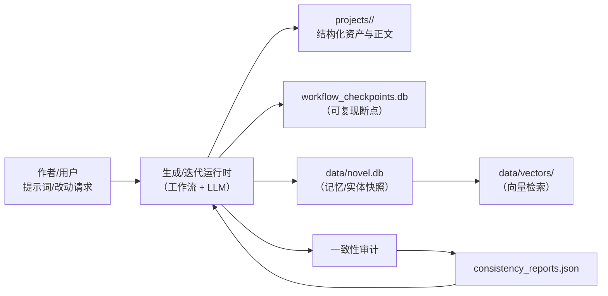

# Novel-Gen 开发宗旨与技术架构

本仓库定位为「长篇小说生成/迭代工作流」的项目资产与规范仓库：以结构化素材（世界观/人物/大纲/分章/正文/审计报告）为核心产物，配套可复现的工作流检查点与记忆库，支撑人机协作的持续创作与回归校验。

## 1. 开发宗旨

### 1.1 核心目标

- **资产化**：把“小说创作过程”沉淀为可读、可检索、可回滚的项目资产，而不是一次性对话。
- **一致性优先**：多章跨度下保持世界观、人物动机、时间线、信息知情链与伏笔线程稳定。
- **可迭代修订**：支持对已有章节/设定进行变更闭环（提出改动 → 影响分析 → 最小改动修订 → 回归审计）。
- **可复现与可追踪**：每次运行/迭代可通过检查点恢复，关键产物落盘并能定位到来源与版本。

### 1.2 非目标

- 追求“一键无人介入出版级终稿”；本项目面向工程化共创与可控迭代。
- 自动抓取/训练外部版权内容。

### 1.3 工程原则

- **结构化优先**：设定/计划/审计报告尽量使用 JSON（或结构化表述），降低“自然语言漂移”。
- **最小改动**：修订优先补过渡、补证据、改台词/动机，不轻易全章推倒重写。
- **回归门禁**：每章定稿、每次变更闭环完成后都应产出一致性审计结果并回写资产。
- **编码正确**：所有文本与 JSON 默认使用 UTF-8，避免出现 `量子...` 类乱码（典型双重编码问题）。

## 2. 技术架构概览

### 2.1 组件划分

- **生成/迭代运行时（外部工具/脚本）**：负责提示词解析、设定生成、大纲/分章/正文产出与修订；可采用工作流引擎（如 LangGraph）编排。
- **一致性与质量审计**：对章节内容进行设定冲突/角色矛盾/能力规则/时间线等检查，产出结构化报告（见 `projects/*/consistency_reports.json`）。
- **项目资产存储（本仓库）**：以 `projects/` 为主，保存每个小说项目的结构化素材与正文。
- **可复现运行存储**：
  - `projects/*/workflow_checkpoints.db`：工作流检查点（SQLite；常见表为 `checkpoints`/`writes`）。
  - `projects/*/data/novel.db`：项目记忆与实体快照库（SQLite；如 `memory_chunks`/`entity_snapshots`）。
  - `projects/*/data/vectors/`：向量检索存储（如 Chroma 的 `chroma.sqlite3`）。
- **规范与变更管理（OpenSpec）**：`openspec/` 目录用于规格化需求与变更提案的管理（面向“怎么改系统/流程”，不是小说内容本身）。

### 2.2 总体数据流（示意）



## 3. 仓库结构（本项目真实结构）

```
docs/
  开发文档.md                 # 本文档
openspec/
  AGENTS.md                   # OpenSpec 规范说明
  project.md                  # 项目约定（如有补充）
  specs/ changes/ archive/    # 规格与变更（按 OpenSpec 组织）
projects/
  <project_name>/             # 一个小说项目（多项目并行）
    settings.json             # 项目元信息（可选，建议存在）
    world.json                # 世界观设定
    characters.json           # 人物设定
    theme_conflict.json       # 主题与冲突
    outline.json              # 故事大纲（总览）
    chapters/                 # 分章资产（计划/正文/修订）
    chapter_memory.json       # 章节级记忆/摘要（可选）
    consistency_reports.json  # 一致性审计报告（可选）
    workflow_checkpoints.db   # 工作流检查点（可选）
    data/
      novel.db                # 记忆/实体快照库（可选）
      vectors/                # 向量库（可选）
      graph                   # 工作流/图快照（二进制，按需）
```


### 3.1 代码结构（建议）

> 背景：本仓库以 `projects/` 项目资产为核心；但为了保证“可复现生成/可回归审计”，建议将生成器与工作流编排代码也纳入同一仓库，或在外部仓库采用一致的目录约定。

#### 3.1.1 推荐代码目录树

```text
app/                          # 生成器主包（建议作为 Python package）
  main.py                     # CLI 入口：run / continue / change / export
  config.py                   # 配置加载：模型、路径、阈值、存储后端
  graph/                      # LangGraph 图定义与装配
    state.py                  # State 定义（TypedDict/Pydantic）
    builder.py                # build_graph 装配节点、路由与循环
    routing.py                # 条件路由：blocker 分支、重跑范围等
    nodes/                    # 工作流节点（纯函数风格，便于测试）
      parse_prompt.py
      build_bible.py
      build_outline.py
      plan_chapter.py
      write_chapter.py
      continuity_check.py     # 调用连续性审计插件
      apply_patch.py          # 最小改动修订与回写
      store_artifacts.py      # 落盘：projects/<project>/...
      commit_version.py       # 语义化提交：manifest + changelog + HEAD
  agents/                     # Agent 插件（专项能力，不作为主流程）
    continuity.py             # 连续性审计：事实抽取/对照/问题清单
    impact.py                 # 影响分析：变更请求 -> 受影响章节集合
    plot_doctor.py            # 可选：剧情医生，多方案修复建议
    editor.py                 # 可选：风格润色，不改事实
  schemas/                    # 输出/输入结构约束（Pydantic/JSONSchema）
    requirements.py
    bible.py
    outline.py
    chapter_plan.py
    issues.py
    change_request.py
  prompts/                    # 提示词模板（系统提示/节点提示/插件提示）
    system/
    nodes/
    agents/
  storage/                    # 存储与版本
    artifact_store.py         # 文件资产读写：对齐 projects/<project>/ 目录
    checkpoint_store.py       # LangGraph checkpointer 适配（SQLite/Postgres）
    commit_manager.py         # commit 管理：manifest/changelog/HEAD
    memory_db.py              # data/novel.db 读写（memory_chunks/entity_snapshots）
    vectorstore.py            # 向量库适配（可选：Chroma/FAISS/pgvector）
  utils/                      # 通用工具
    ids.py
    json_io.py
    diff.py                   # 最小补丁与差异摘要
    text.py
scripts/                      # 一次性脚本/迁移/数据修复工具（可选）
  init_project.py
  migrate_assets.py
  export_book.py
  backfill_memory.py

tests/                        # 单元测试与契约测试
  test_schemas.py             # 所有 JSON 输出必须通过 schema 校验
  test_routing.py
  test_continuity.py

pyproject.toml / requirements.txt
.env.example
```

#### 3.1.2 代码与资产的对齐关系

- `app/storage/artifact_store.py` 负责把工作流产物写入 `projects/<project_name>/` 下的既定文件：
  - `world.json`、`characters.json`、`theme_conflict.json`、`outline.json`
  - `chapters/chapter_XXX_plan.json`、`chapters/chapter_XXX.json`、`chapters/chapter_XXX_revised.txt`
  - `consistency_reports.json`、`chapter_memory.json`
- `app/storage/memory_db.py` 管理 `projects/<project>/data/novel.db`：
  - `memory_chunks` 用于可检索摘要与事实片段
  - `entity_snapshots` 用于角色/势力/关键物品的状态快照
- `app/storage/checkpoint_store.py` 管理 `projects/<project>/workflow_checkpoints.db`：
  - 用于断点续跑与复现运行过程（运行级别的 checkpoint）
- `app/storage/commit_manager.py` 管理语义化版本：
  - `manifest.json` + `changelog` + `HEAD` 指针（作品级别的 commit）

#### 3.1.3 约束与建议

- **节点纯函数化**：`graph/nodes/` 的节点尽量只读写 State，不做隐式 I/O；I/O 统一放在 `storage/`。
- **Schema 先行**：所有节点与 Agent 的输出先过 `schemas/` 校验，再写入 `projects/`，避免“资产污染”。
- **插件边界清晰**：连续性审计插件默认“只查不写”，修订由 `apply_patch` 节点负责，必要时回写 Bible/记忆。

> 若生成器代码不在本仓库，也建议外部仓库保持上述目录语义与输出格式一致，以保证本仓库资产可复现与可回归。

## 4. 项目资产数据模型（约定）

本节以“现有项目产物”归纳出约定，用于指导新增脚本/工作流的输出格式。

### 4.1 `settings.json`（建议必填）

- `project_name`：项目名（与目录一致）
- `author`：作者/维护者
- `world_description` / `theme_description`：高层设定摘要
- `num_chapters`：计划章节数（可选）

### 4.2 `world.json` / `characters.json` / `theme_conflict.json`

- 面向“可检索与可回写”的设定资产，字段允许随项目演进扩展，但要求：
  - UTF-8 编码；
  - Key 命名稳定；
  - 允许下游审计/检索按字段定位（例如 `power_system`、`relationships`）。

### 4.3 `outline.json`

- 存放总纲信息，常见包含：
  - `story_premise`、`beginning/development/climax/resolution`
  - `chapters[]`：每章标题、摘要、关键事件、依赖等

### 4.4 `chapters/`

- `chapter_XXX_plan.json`：章节计划（按场景拆分，包含 `location`、`characters`、`purpose`、`key_actions`、字数预估等）。
- `chapter_XXX.json`：章节正文（常见为 `scenes[]`，每个场景含 `content`）。
- `chapter_XXX_revised.txt`：修订版纯文本（可选，用于“对比/导出/人工审阅”）。
- `scene_YYY_ZZZ.json`：当采用“章节-场景”作为最小单元时的正文资产（现有项目中可见）。

### 4.5 一致性审计与记忆

- `consistency_reports.json`：审计问题列表（建议包含 `issue_type`、`description`、`severity`、`fix_instructions` 等）。
- `chapter_memory.json`：章节级摘要、关键事件、未解线程、角色状态等（用于检索与回归）。
- `data/novel.db`：
  - `memory_chunks`：可检索的记忆片段（支持章节/场景维度、标签、实体提及、embedding 关联）。
  - `entity_snapshots`：实体状态快照（按时间/章节/场景索引）。
- `workflow_checkpoints.db`：工作流断点续跑（常见表 `checkpoints` 与 `writes`）。

## 5. 工作方式（建议流程）

1. **新建项目**：在 `projects/<name>/` 初始化 `settings.json`，并生成 `world.json`、`characters.json`、`theme_conflict.json`、`outline.json`。
2. **按章产出**：为每章先生成 `chapter_XXX_plan.json`，再生成 `chapter_XXX.json`（或按场景拆分）。
3. **一致性审计**：生成/修订后更新 `consistency_reports.json` 与 `chapter_memory.json`（及 `data/novel.db`）。
4. **最小改动修订**：对 `high` 严重度问题优先闭环；修订需同步更新对应的记忆/快照，避免“正文变了但记忆没变”。
5. **导出与归档**：可按项目维护 `*_full.txt/.md` 等导出文件（现有项目中已有实践）。

## 6. 约束与注意事项

- **大文件**：`projects/*/data/graph`、向量库与数据库可能较大；如需长期保留，建议统一约定压缩/分层存放策略。
- **隐私与密钥**：`.env` 类文件不应包含可公开的密钥；如需共享配置，建议使用示例文件并在 `.gitignore` 中忽略真实密钥文件。


## 7. 快速开始（完整工程版）

> 目标：让新加入的开发者在 10 分钟内完成“安装 → 配置 → 生成 1 章 → 审计 → 产物落盘”的闭环。

> 总体 MVP 任务清单：`docs/MVP_TASKS.md`

### 7.1 环境与依赖

- 推荐 Python：3.11 或 3.10（保持团队统一）
- 依赖管理：推荐 `pyproject.toml` + `uv` 或 `poetry`；也可兼容 `requirements.txt`
- 本项目涉及的关键库（建议）：
  - langgraph
  - pydantic
  - sqlite3 或 SQLAlchemy
  - 向量检索可选：chromadb 或 faiss 或 pgvector

### 7.2 配置文件与环境变量

建议使用 `.env`（不要提交真实密钥），并提供 `.env.example`。推荐配置项：

- `MODEL_PROVIDER`：openai / azure / local
- `MODEL_NAME`：模型名称
- `MODEL_BASE_URL`：可选
- `MODEL_API_KEY`：密钥
- `PROJECT_NAME`：当前项目目录名，对应 `projects/<project_name>/`
- `NUM_CHAPTERS`：默认生成章节数
- `QA_BLOCKER_MAX`：阻断级最大允许数，建议 0
- `QA_MAJOR_MAX`：主要问题允许阈值
- `CHECKPOINT_DB`：默认 `projects/<project>/workflow_checkpoints.db`
- `MEMORY_DB`：默认 `projects/<project>/data/novel.db`

### 7.3 CLI 运行约定

> v2 MVP 已实现的命令；若生成器不在本仓库，也建议外部仓库保持一致命令语义。

- 初始化项目（创建 settings.json 等）：

```bash
python -m app.main init --project <project_name>
# 或使用 uv
uv run python -m app.main init --project <project_name>
```

- 从提示词生成（MVP：生成 1~N 章）：

```bash
python -m app.main run --project <project_name> --prompt "一句话设定" --chapters 1
# 或使用 uv
uv run python -m app.main run --project <project_name> --chapters 1 --prompt "一句话设定"
```

**run 命令选项：**
  - `--project, -p`：项目名（可选，也可通过 PROJECT_NAME 环境变量指定）
  - `--chapters, -c`：生成章节数（可选，默认使用配置中的 NUM_CHAPTERS）
  - `--prompt`：初始提示词（可选）

- 继续运行（从 checkpoint 恢复）：

```bash
python -m app.main continue --project <project_name>
```

> 注：`continue` 命令在 MVP 中为占位符，完整实现计划中。

- **[计划中]** 变更请求闭环（影响分析 → 增量重跑 → 回归）：

```bash
# 计划实现，当前 MVP 未包含
python -m app.main change --project <project_name> --request "把第7章主角动机改为……"
```

- **[计划中]** 导出（可选）：

```bash
# 计划实现，当前 MVP 未包含
python -m app.main export --project <project_name> --format md
```

### 7.4 运行产物落盘约定

- 章节资产：`projects/<project>/chapters/`
- 一致性审计：`projects/<project>/consistency_reports.json`
- 章节级记忆：`projects/<project>/chapter_memory.json` 以及 `projects/<project>/data/novel.db`
- 运行检查点：`projects/<project>/workflow_checkpoints.db`
- 语义化版本：见第 11 节


## 8. LangGraph 工作流设计（节点与路由）

### 8.1 图的拆分建议

推荐至少两张图：

- 生成主图：从 prompt 生成到按章产出与审计
- 变更闭环图：change request 影响分析与增量重跑

### 8.2 生成主图节点清单（建议）

- `parse_prompt`：解析用户提示词，写入 `requirements`
- `build_or_update_bible`：生成或更新 bible 资产与关键索引
- `build_outline`：生成 `outline.json`
- `retrieve_context_pack`：为当前章检索上下文包
- `plan_chapter`：生成 `chapter_XXX_plan.json`
- `write_chapter`：生成章节草稿 `chapter_XXX.json` 或 `chapter_XXX_revised.txt`
- `continuity_check`：调用连续性审计插件，产出 issues
- `apply_patch`：根据 issues 做最小修订，必要时回写 bible 与记忆
- `store_artifacts`：落盘到 `projects/<project>/...`
- `commit_version`：语义化提交（作品级版本）

### 8.3 路由与循环规则（必须写清楚）

- 章节循环：从 `chapter_id = 1` 到 `num_chapters`
- 审计循环：当 `blocker > 0` 时进入修订并回到审计
- 最大修订轮次：建议为 3~5 次，避免死循环
- 失败策略：达到最大轮次仍存在 blocker，则：
  - 将本章标记为 `needs_human_review`
  - 写入审计报告，并停止自动推进

> 约定：章节能“进入下一章”的唯一条件是 `blocker == 0`。


## 9. State 状态对象（LangGraph State）定义与字段契约

> State 是工作流的共享黑板：节点不互相直接传参，统一通过 State 读写。

### 9.1 State 字段分组（建议）

- `requirements`：需求规格
- `bible`：权威状态（world/characters/timeline/threads/style_guide）
- `outline`：全局大纲
- `runtime`：运行控制（当前章号、阈值、重试次数、成本统计）
- `artifacts`：章节计划、正文、审计结果（内存态缓存）
- `change`：变更请求、影响范围、回归结果

### 9.2 字段契约表（示例）

| 字段 | 类型 | 产生节点 | 消费节点 | 说明 |
| --- | --- | --- | --- | --- |
| requirements | dict | parse_prompt | build_or_update_bible, build_outline | 项目需求与风格约束 |
| bible | dict | build_or_update_bible, apply_patch | plan_chapter, write_chapter, continuity_check | SSOT 权威状态 |
| outline | dict | build_outline | plan_chapter, write_chapter | 全局因果链与章节摘要 |
| current_chapter | int | runtime init | plan_chapter, write_chapter | 当前章序号 |
| chapter_plan | dict | plan_chapter | write_chapter, continuity_check | 本章结构化计划 |
| chapter_draft | str or dict | write_chapter | continuity_check, apply_patch | 本章草稿 |
| issues | dict | continuity_check | apply_patch, store_artifacts | 审计问题清单 |
| bible_updates | dict | apply_patch | build_or_update_bible, store_artifacts | 需要回写的设定更改 |
| affected_chapters | list | impact | rewrite loop | 变更影响范围 |

### 9.3 节点输入输出约束

- 节点应返回“增量更新”，只修改自己负责的字段
- I/O 落盘不应散落在各节点，统一由 `store_artifacts` 与 `commit_version` 处理
- 所有结构化输出在写入项目资产前必须通过 schema 校验（见第 10 节）


## 10. 数据契约与 Schema 版本（必备）

> 目标：任何节点与 Agent 的输出都可机器校验，避免资产污染与回归失败。

### 10.1 Schema 版本字段

建议所有关键 JSON 增加：

- `schema_version`：例如 `1.0`
- `generated_at`：ISO 时间
- `generator`：模型与版本、运行编号

### 10.2 Chapter Plan 最小字段（建议）

`chapters/chapter_XXX_plan.json` 至少包含：

- `chapter_id`
- `pov`
- `goal`、`conflict`、`turn`
- `reveal`：信息揭示点
- `threads_advance`：推进哪些线程
- `must_include`、`must_avoid`

示例：

```json
{
  "schema_version": "1.0",
  "chapter_id": 1,
  "pov": "主角",
  "goal": "进入禁区寻找线索",
  "conflict": "守卫阻拦与内心恐惧",
  "turn": "发现守卫与线索相关",
  "reveal": ["禁区并非传言那样荒废"],
  "threads_advance": ["T-01"],
  "must_include": ["关键物品A首次出现"],
  "must_avoid": ["解释终极谜底"]
}
```

### 10.3 一致性审计 Issues 最小字段（建议）

`consistency_reports.json` 或单章 issues 输出建议包含：

- `chapter_id`
- `issues[]`：每条包含 `severity`、`category`、`summary`、`evidence`、`fix_options`
- `updates`：建议回写的 timeline/threads/facts 变更

示例：

```json
{
  "schema_version": "1.0",
  "chapter_id": 1,
  "issues": [
    {
      "id": "I-001",
      "severity": "blocker",
      "category": "timeline",
      "summary": "主角同一时间出现在两地",
      "evidence": {
        "chapter_quote": "他在黄昏抵达北门，又在同一段落出现在南港。",
        "bible_ref": "timeline.events.E-12"
      },
      "fix_options": [
        {
          "strategy": "最小改动",
          "patch_hint": "将南港场景改为次日清晨，并补一段路途过渡",
          "side_effects": "影响第2章开头时间标注"
        }
      ]
    }
  ],
  "updates": {
    "timeline_updates": ["E-12 time = D+1 morning"],
    "thread_updates": []
  }
}
```

### 10.4 向后兼容策略

- 新增字段优先而非改名
- 重要字段改名必须保留旧字段一段时间并在生成端双写
- `schema_version` 升级必须提供迁移脚本或兼容读取逻辑


## 11. 版本管理（语义化 Commit 与 Manifest）

> 本项目区分两层：
> - checkpoint：运行过程快照，用于断点续跑
> - commit：作品级版本，用于对比、回滚、发布

### 11.1 建议的版本目录布局

以项目维度存放版本：

- `projects/<project>/versions/HEAD`：当前版本指针，内容为 commit_id
- `projects/<project>/versions/commits/<commit_id>/manifest.json`
- `projects/<project>/versions/commits/<commit_id>/changelog.md`
- `projects/<project>/versions/commits/<commit_id>/snapshots/`：可选快照（bible/chapters/issues）

### 11.2 Commit 触发策略（推荐默认）

- 每章通过 QA 且 `blocker == 0` 时自动提交一次
- 每次变更请求闭环完成且回归通过时提交一次
- Bible 发生结构性更新时可额外提交一次（或合并进章节提交）

### 11.3 Manifest 建议格式

```json
{
  "commit_id": "c_20251217_001",
  "parent": "c_20251217_000",
  "message": "第1章定稿并通过审计",
  "created_at": "2025-12-17T10:00:00Z",
  "bible": {
    "world": "world.json",
    "characters": "characters.json",
    "timeline": "data/novel.db#entity_snapshots",
    "threads": "consistency_reports.json"
  },
  "chapters": {
    "001": {
      "plan": "chapters/chapter_001_plan.json",
      "content": "chapters/chapter_001.json",
      "revised": "chapters/chapter_001_revised.txt",
      "issues": "consistency_reports.json#chapter_001"
    }
  }
}
```

### 11.4 对比与回滚约定

- diff：对比两个 commit 的 manifest，列出变更章节、bible 更新点、QA 统计
- rollback：将 `HEAD` 指针切回旧 commit_id，并按 manifest 恢复/引用对应资产


## 12. 一致性审计与回归门禁（强规范）

### 12.1 审计分类（建议固定枚举）

- `world_rule`：世界规则冲突、能力上限、地理常识
- `character`：动机漂移、性格不一致、关系矛盾
- `timeline`：时间顺序、旅行时间、同一时间两地
- `knowledge`：知情链违规、信息泄露
- `thread`：伏笔未登记、回收过早/过晚、挖坑不填
- `pov_style`：视角错误、文风严重漂移

### 12.2 门禁规则（建议默认）

- blocker 必须为 0 才能定稿
- major 可配置阈值（如 <= 3）
- knowledge 类 blocker 优先级最高，默认必须清零

### 12.3 回归范围规则（建议）

- 当变更影响到 bible 的关键字段（人物动机/世界规则/关键事件）时：
  - 至少回归受影响章节区间，以及其后 1~2 章（防止后续承接矛盾）
- 当仅为表达润色：
  - 只需要风格校验，不必全量一致性回归

### 12.4 记忆回写一致性

- 正文变更必须同步更新：
  - `chapter_memory.json`
  - `data/novel.db` 中对应 `memory_chunks` 与 `entity_snapshots`

> 目标：避免“正文变了但记忆没变”，否则检索与回归会被旧信息污染。


## 13. Prompt 与模型配置规范

### 13.1 Prompt 分层建议

- system：全局写作原则与安全边界
- nodes：每个工作流节点的任务提示（解析/设定/大纲/分章/写作）
- agents：审计与分析类提示（必须输出 JSON、必须引用证据）

### 13.2 结构化输出硬约束

- 所有需要结构化的输出必须：
  - 明确声明输出为纯 JSON
  - 声明字段名与枚举值
  - 禁止输出多余解释文本

### 13.3 采样与成本策略（建议默认）

- 规划与审计：temperature 较低（0.2~0.5）
- 写作：temperature 中等（0.7~1.0）
- 重试策略：JSON 解析失败可自动重试 1~2 次，并将错误反馈给模型
- 超时与预算：每章最大修订轮次 + 每轮最大 token


## 14. 安全、合规与协作规范

### 14.1 密钥与隐私

- `.env` 与任何真实 key 不入库
- 日志与审计报告避免包含敏感个人信息

### 14.2 版权与素材

- 避免直接写入或导出大段受版权保护的外部文本
- 若使用外部素材，建议以“摘要/要点”形式入库，并注明来源（内部使用即可）

### 14.3 协作与变更管理

- 规格与变更提案统一写入 `openspec/`（系统怎么改、流程怎么变）
- 重要改动必须：
  - 更新本开发文档对应章节
  - 提供迁移脚本或兼容策略（尤其 schema 变化）

### 14.4 测试与质量要求

- 新增或修改结构化输出必须补充 `tests/test_schemas.py`（schema 校验）
- 路由与循环逻辑必须补充 `tests/test_routing.py`
- 连续性审计输出字段变更必须补充契约测试
