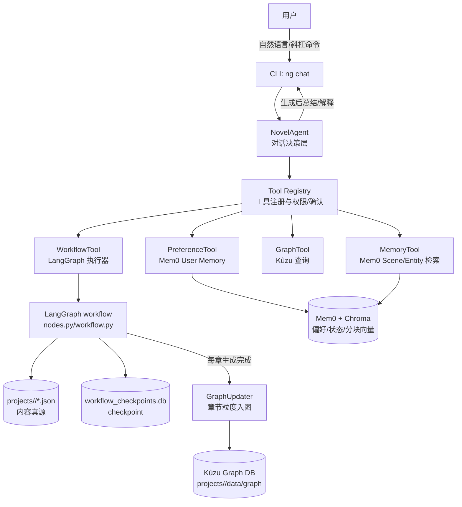
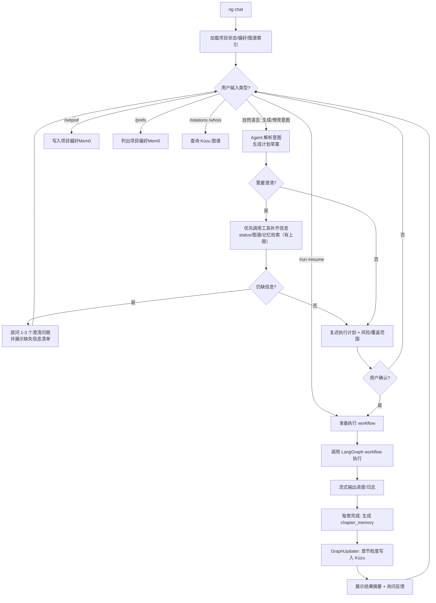

# NovelGen 重构文档（Agent-first + Kùzu 图数据库 + Mem0 记忆层）

作者：Jamesenh  
更新时间：2025-12-15  

> 目标：将当前 NovelGen 从“以 Workflow 为中心的生成器”升级为“以对话式 Agent 为中心的创作系统”，并引入 **嵌入式图数据库 Kùzu** 来增强人物/关系/事件的结构化检索能力。  
> 约束：保留现有 LangGraph 工作流作为**可靠执行器（Executor）**，确保断点续跑、回滚、文件落盘等成熟能力不被破坏。

---

## 1. 背景与问题

当前工程的核心优势是：
- **LangGraph 工作流**已能稳定执行世界观→主题冲突→角色→大纲→章节计划→场景生成，并支持 **SQLite checkpoint** 断点恢复。
- **Mem0Manager** 已实现：项目级用户偏好（预留）、角色状态（Agent Memory）、场景文本分块向量存储与搜索。

当前要实现“对话式 Agent + 更懂你（每项目偏好）+ 更强人物检索”的痛点是：
- 系统缺少**对话式决策层**（Chat/REPL/多轮澄清/确认动作/偏好治理）。
- “更懂你”的关键链路（**偏好检索→注入 prompt→生成生效**）尚未完成闭环。
- 人物信息检索目前主要依赖：角色 JSON + Mem0 文本向量/状态文本，缺少可回答关系型问题的**结构化知识层**。

---

## 2. 重构目标（Agent-first）

### 2.1 产品目标
- **对话式创作**：用户通过聊天驱动“生成/回滚/改写/查询/导出”。
- **每项目偏好（自然语言）**：一个项目一套偏好（“这本书我想要的风格/节奏/表达习惯”），可随时查看、撤销、覆盖。
- **人物检索增强（Kùzu）**：支持关系、事件、出场、状态轨迹等结构化检索，并能给出“证据来源”（章/场景/摘要）。

### 2.2 工程目标
- **工作流保留**：LangGraph workflow 继续做确定性执行与落盘（JSON 真源 + checkpoint）。
- **Agent 只做决策**：Agent 通过 Tools 调用 workflow、Mem0、Kùzu，不把业务逻辑塞进 LLM。
- **数据层分工清晰**：
  - JSON：内容真源（生成结果与关键结构）
  - Mem0/Chroma：语义记忆（偏好、角色状态文本、场景片段）
  - Kùzu：结构化知识图谱（人物/关系/事件/证据）

---

## 3. 总体技术架构（技术架构图）

> 说明：Agent 是“对话与决策核心”，workflow 是“可恢复执行器”。Kùzu 提供结构化检索能力，Mem0 提供偏好与语义记忆能力。



---

## 4. 数据层设计

### 4.1 项目目录布局（每项目一套偏好/图谱）

建议保持并强化以下目录约定：

```
projects/<project_id>/
  settings.json
  world.json
  theme_conflict.json
  characters.json
  outline.json
  chapter_memory.json
  consistency_reports.json
  workflow_checkpoints.db
  chapters/
    chapter_001_plan.json
    chapter_001.json
    scene_001_001.json          # 可选：场景级断点文件
  data/
    vectors/                    # Mem0/Chroma 持久化目录（现有）
    graph/                      # Kùzu 数据目录（新增）
      kuzu.db/                  # Kùzu 文件夹（示意）
```

### 4.2 JSON 真源（不变）
- 所有生成内容（世界观/角色/大纲/章节/记忆）仍以 JSON 为真源，便于可读、可导出、可回滚。

### 4.3 Mem0（每项目偏好 + 语义记忆）
- **偏好**：每个项目一套（符合当前选择），以 `user_id="author_{project_id}"` 为隔离粒度存储。
- **角色状态**：以 `agent_id="{project_id}_{character_name}"` 记录角色状态（已存在）。
- **场景记忆**：以统一 `agent_id="{project_id}_scene_content"` 存储分块向量，支持语义检索（已存在）。

### 4.4 Kùzu（结构化知识图谱）
定位：解决“人物/关系/事件/证据”类问题，给 Agent 提供可查询、可解释的事实视图。

#### 最小 Schema（章节粒度入图的 P0）
- **节点表（Node）**：
  - `Character(id, project_id, name, role, ...)`
  - `Chapter(id, project_id, chapter_number, title, timeline_anchor)`
  - `Event(id, project_id, chapter_number, summary, tags)`
- **关系表（Rel）**：
  - `RELATES_TO(from: Character, to: Character, type, description, first_chapter, last_chapter, evidence_ref)`
  - `INVOLVED_IN(character -> event, role_in_event, evidence_ref)`
  - `EVENT_IN_CHAPTER(event -> chapter, evidence_ref)`

> 说明：初期不追求“全自动抽取所有三元组”，先用章节记忆（`ChapterMemoryEntry.key_events/character_states`）驱动入图，保证稳定与可解释。

---

## 5. 图谱写入策略（章节粒度）

### 5.1 写入时机（建议）
在 workflow 的章节生成完成后，已有一个固定的“章节记忆生成”环节（`chapter_memory.json`）。图谱更新应挂在：
- **生成章节记忆条目成功后**（`ChapterMemoryEntry` 已生成且落盘）
- 或者更严格：在 `chapter_memory.json` 成功写入后再入图

### 5.2 写入内容（P0）
- Chapter 节点：章节号、标题、时间锚点
- Event 节点：从 `key_events` 生成事件条目（每章若干个）
- 角色参与：从章节记忆/场景计划中的角色列表推断角色参与事件
- 关系更新：
  - **基础关系**：从 `characters.json` 的 `relationships` 初始化到 `RELATES_TO`
  - **章节变化（可选）**：如果章节记忆/一致性报告明确提到关系变化，更新 `last_chapter` 与 `evidence_ref`

### 5.3 证据（evidence_ref）
每条写入都应带证据引用，至少包含：
- `chapter_number`
- `source`: `characters_json` / `chapter_memory` / `chapter_text`（后续扩展）
- `snippet`: 50-200 字的引用片段（用于解释）

---

## 6. Agent 交互方式（最终对用户提供什么）

### 6.1 主入口
- `ng chat <project_id>`：进入对话式会话（REPL），默认加载项目状态与偏好

### 6.2 输入形式
#### 1）自然语言
- “这本书文风克制、少形容词、多心理描写”
- “生成到第 3 章，先别写后面的”
- “查询一下：主角和师父在第几章关系发生了变化？”

#### 2）斜杠命令（确定性操作）
建议最小命令集：
- **流程控制**：`/run` `/resume` `/stop` `/status` `/export`
- **偏好**：`/prefs` `/setpref <自然语言>` `/forget <pref_id>`
- **知识检索（Kùzu）**：`/whois <角色名>` `/relations <角色名>` `/why <回答编号>`
- **回滚与重写**：`/rollback chapter=3` `/rewrite chapter=3 scene=2`

### 6.3 输出原则（让“更懂你”可解释）
- 每次生成前：输出“本次生效偏好 Top N（项目级）”
- 每次生成后：输出“偏好是否生效的观察点 + 可选改进建议”
- 每次知识问答：输出“结论 + 证据（章节/事件/引用片段）”
- 信息不足时：输出“缺失信息清单（MissingInfo）”，并遵循“工具优先补齐”的原则（先 status/图谱/记忆检索，再向用户提问）

---

## 7. 对话流程图（交互流程图）



---

## 8. 建议的项目结构（重构后）

> 原则：新增 agent/graph/tool 模块，不破坏现有 chains/runtime 的稳定路径；逐步迁移 CLI。

```
novelgen/
  agent/
    chat.py                 # ng chat 的 REPL/会话管理
    policy.py               # 决策逻辑（何时澄清、何时执行、何时写偏好）
    prompts.py              # Agent 系统提示与回复模板（中文）
  tools/
    registry.py             # 工具注册、权限、确认与 max_calls 控制
    workflow_tools.py       # run/resume/rollback/export/status
    preference_tools.py     # set/list/forget 偏好（Mem0）
    graph_tools.py          # whois/relations/path 等（Kùzu）
    memory_tools.py         # Mem0 场景/实体检索（已有能力工具化）
  graph/
    kuzu_store.py           # Kùzu 连接、schema、CRUD、查询封装
    updater.py              # chapter_memory -> 图谱写入（章节粒度）
  runtime/
    workflow.py             # 现有（保留）
    nodes.py                # 现有（保留）
    mem0_manager.py         # 现有（保留）
  chains/
    ...                     # 现有（保留）
```

---

## 9. 重构里程碑计划（建议）

### Milestone 0（基线保障）
- 不改动现有 workflow 的对外行为与项目文件结构
- 增加“可重建图谱”的离线命令（从 JSON 重新入图），确保可恢复

### Milestone 1（P0：Kùzu 图谱最小闭环）
- 引入 `kuzu_store` 与项目级图谱目录（`projects/<id>/data/graph`）
- 从 `characters.json` 初始化人物与关系到图谱
- 每章生成后：从 `chapter_memory.json` 增量写入 Event 与参与关系
- 提供 CLI 查询命令（非对话）：`ng graph whois/relations`

### Milestone 2（P1：对话式 Agent MVP）
- `ng chat <project>`：对话循环 + slash 命令
- 偏好治理：`/setpref /prefs /forget`
- 生成治理：`/run /resume /rollback /export`
- **关键验收**：每次生成前从 Mem0 取出项目偏好，并注入到场景生成 prompt（保证“更懂你”生效）

### Milestone 3（P2：增强“懂你”的反馈学习）
- 从用户反馈中提炼偏好候选（必须二次确认才写入 Mem0）
- 增加 `/why`：解释“本次回答/生成使用了哪些偏好与证据”

---

## 10. 验收标准（Definition of Done）

### 对话式 Agent
- 能通过 `ng chat <project>` 完成：设置偏好→运行生成→查询人物关系→回滚并重写
- 所有破坏性动作（覆盖/回滚/清理记忆）必须先确认

### 每项目偏好（自然语言）
- 偏好能持久化（Mem0）
- 下一次场景生成能显著体现偏好（至少可通过对话观察与测试用例验证）

### Kùzu 图数据库（章节粒度入图）
- 角色关系初始化可查
- 每章入图后，能回答：某角色参与了哪些事件、事件发生在哪章、证据来源是什么

---

## 11. 风险与应对
- **JSON 与图谱不一致**：提供 `rebuild_graph` 命令从 JSON 全量重建
- **抽取质量不足**（章节记忆不包含关系变化）：先依赖 `characters.json`，后续再加“关系抽取链”作为可选增强
- **嵌入式并发**：以单进程写入为主；若引入并行生成，写入层需加锁或队列化

---

## 12. 后续可选增强
- 引入"关系/事件抽取链"（LLM→结构化输出→入图），提升图谱覆盖率
- 场景级入图（比章节更细），但成本更高
- 结合 Kùzu + Mem0：回答时同时返回结构化事实与语义证据片段

---

## 13. 实现状态（2025-12-15 更新）

### ✅ 已完成

#### Milestone 0（基线保障）
- [x] 项目级图谱目录约定 `projects/<id>/data/graph`
- [x] `ng graph rebuild` 命令：从 JSON 全量重建图谱
- [x] 图谱层开关配置 `NOVELGEN_GRAPH_ENABLED`

#### Milestone 1（Kùzu 图谱最小闭环）
- [x] 引入 Kùzu Python 依赖
- [x] 实现 `novelgen/graph/kuzu_store.py`：连接、Schema、CRUD、查询封装
- [x] 实现 `novelgen/graph/updater.py`：章节记忆→图谱写入
- [x] 将 GraphUpdater 挂接到章节完成点（自动增量更新）
- [x] CLI 查询命令：`ng graph whois/relations/events/stats`

#### Milestone 2（对话式 Agent MVP）
- [x] `ng chat <project>`：对话循环 + 斜杠命令
- [x] 工具注册与安全门：`novelgen/tools/registry.py`
- [x] 工具集实现：
  - `workflow_tools.py`：run/resume/status/rollback/export
  - `preference_tools.py`：set/list/forget 偏好
  - `graph_tools.py`：whois/relations/events
  - `memory_tools.py`：场景/实体检索
- [x] 默认确认策略 + `/auto on|off`
- [x] 偏好注入闭环：场景生成时自动检索并注入用户偏好

### 🚧 待完成

#### Milestone 3（增强"懂你"的反馈学习）
- [ ] 从用户反馈中提炼偏好候选（必须二次确认才写入 Mem0）
- [ ] 增加 `/why`：解释"本次回答/生成使用了哪些偏好与证据"

### 📝 实现细节

#### 新增文件
```
novelgen/
  agent/
    __init__.py
    chat.py               # 对话式 Agent 核心
  tools/
    __init__.py
    registry.py           # 工具注册与安全门
    workflow_tools.py     # 工作流相关工具
    preference_tools.py   # 偏好管理工具
    graph_tools.py        # 图谱查询工具
    memory_tools.py       # 记忆检索工具
  graph/
    __init__.py
    kuzu_store.py         # Kùzu 数据库封装
    updater.py            # 图谱更新器
```

#### 新增 CLI 命令
- `ng chat <project>`：启动对话式会话
- `ng graph rebuild <project>`：重建知识图谱
- `ng graph whois <project> <name>`：查询角色信息
- `ng graph relations <project> <name>`：查询角色关系
- `ng graph events <project> <name>`：查询角色事件
- `ng graph stats <project>`：显示图谱统计

#### 配置项
```bash
# 图谱配置
NOVELGEN_GRAPH_ENABLED=true    # 启用/禁用图谱
NOVELGEN_GRAPH_DIR=data/graph  # 图谱目录（相对于项目目录）

# 对话 Agent 配置
NOVELGEN_CHAT_CONFIRM_DEFAULT=true  # 默认需要确认
NOVELGEN_CHAT_MAX_TOOL_CALLS=10     # 单轮最大工具调用次数
NOVELGEN_CHAT_RETRIEVAL_MAX_ATTEMPTS=3  # 信息补齐最大尝试次数
```
